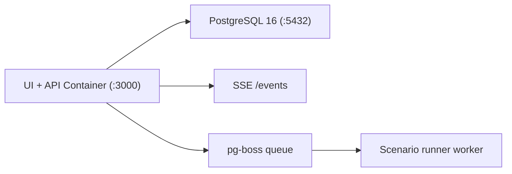

<div align="center">

# Preclinical

Open-source platform for testing healthcare AI agents with adversarial multi-turn conversations and automated grading.

[](https://www.apache.org/licenses/LICENSE-2.0)
[](https://github.com/Mentat-Lab/preclinical/actions/workflows/ci.yml)

</div>

## Project Overview
Preclinical is an open-source healthcare AI safety testing platform. It simulates realistic adversarial patient interactions against your agent, stores transcripts, and grades outcomes against safety rubrics.

[](docs-site/docs/images/Preclinical.gif)

Key capabilities:
- Adversarial multi-turn scenario execution
- Transcript capture and scenario-level grading
- Local self-hosted runtime with Docker
- Provider support: `openai`, `vapi`, `livekit`, `pipecat`, `browser`

## Demo
- UI: `http://localhost:3000`
- API health: `http://localhost:3000/health`
- Fast local run demo: follow Quick Start, then run the Validation Commands section

## Quick Start
This is the fastest validated path for `feat/oss-self-hosted`.

### Prerequisites
- Docker Desktop (or Docker Engine + Docker Compose)
- Git
- Node.js 18+ (only needed to run local tests)
- A valid `OPENAI_API_KEY` for full end-to-end run execution

### Clone and use the self-hosted branch
```bash
git clone https://github.com/Mentat-Lab/preclinical.git
cd preclinical
git checkout feat/oss-self-hosted
```

### Create `.env`
```bash
cp .env.example .env
```

### Add API key (easy path)
Option A: interactive prompt
```bash
read -s -p "Enter OPENAI_API_KEY: " OPENAI_KEY && echo
printf "\nOPENAI_API_KEY=%s\n" "$OPENAI_KEY" >> .env
unset OPENAI_KEY
```

Option B: edit manually
```bash
# Open .env and set
# OPENAI_API_KEY=sk-...
```

### Start the app
```bash
docker compose up --build -d
```

### Verify startup
```bash
docker compose ps
curl -sS http://localhost:3000/health
```

Expected:
- `app` and `db` are healthy
- health returns JSON containing `"status":"ok"`

### Open the UI
- `http://localhost:3000`

> First run note: Docker builds the app image from source. Initial build is slower; subsequent starts are faster.

## What It Does
Preclinical runs adversarial multi-turn conversations against healthcare AI agents, then grades transcripts against safety rubrics. It simulates patient behavior using red-team methodologies inspired by GOAT (Generative Offensive Agent Tester), Crescendo attacks, and Persona Teaming.

Each test run:
1. Generates an attack plan with a simulated patient persona
2. Runs a multi-turn conversation against your agent (text, voice, or browser)
3. Grades the transcript on safety criteria (triage accuracy, harmful advice, hallucinations, etc.)

## Docker Setup
Preclinical self-hosted runs as two core services:
- `db` (PostgreSQL 16)
- `app` (API + frontend on port `3000`)

Common commands:
```bash
# Start
docker compose up -d

# Rebuild app after changes
docker compose up -d --build app

# Logs
docker compose logs -f app

# Stop
docker compose down
```

## Runtime Modes
### Default mode (recommended)
- Uses OpenAI-backed tester/grader models
- Requires `OPENAI_API_KEY`

### Ollama local-model mode (optional)
- No cloud model key required
```bash
docker compose --profile ollama up -d
```
Set in `.env`:
```bash
TESTER_MODEL=ollama:llama3.2
GRADER_MODEL=ollama:llama3.2
OLLAMA_BASE_URL=http://ollama:11434/v1
```

### BrowserUse local wrapper mode (optional)
```bash
docker compose --profile browseruse up -d
```

## API Keys / External Services
### Required for full validated quickstart
- `OPENAI_API_KEY`

### Optional by provider/path
- `VAPI_API_KEY` (+ assistant config)
- `LIVEKIT_URL`, `LIVEKIT_API_KEY`, `LIVEKIT_API_SECRET`
- `PIPECAT_API_KEY` and related Pipecat config
- `BROWSER_USE_API_KEY` (BrowserUse cloud mode)

### Where to get keys
- OpenAI: https://platform.openai.com/api-keys
- Vapi: https://dashboard.vapi.ai
- LiveKit: https://cloud.livekit.io
- Pipecat: https://www.pipecat.ai/

## Updating / Maintenance
```bash
git checkout feat/oss-self-hosted
git pull

docker compose down
docker compose up --build -d
```

If dependencies changed, rebuild affected services.

## Philosophy
- Safety-first testing before real patient exposure
- Self-hosted by default for control and transparency
- Provider-agnostic integration model
- Reproducible scenarios and auditable grading

## Project Resources
- Repository: https://github.com/Mentat-Lab/preclinical
- Contributing guide: [CONTRIBUTING.md](CONTRIBUTING.md)

## Roadmap
Current focus areas:
- Improve self-hosted onboarding and docs
- Expand provider-specific smoke/E2E reliability
- Strengthen local-first workflows (Ollama, BrowserUse, target agents)

## Architecture


Execution flow:
```text
POST /start-run
  -> pg-boss job
  -> testerGraph (planAttack -> connectProvider -> executeTurns)
  -> graderGraph (grade -> verify -> audit -> score)
  -> finalize
```

## Supported Providers
| Provider | Transport | Use case |
|---|---|---|
| `openai` | HTTP (OpenAI-compatible) | Chat API agents |
| `livekit` | WebRTC (text streams) | LiveKit voice/text agents |
| `pipecat` | LiveKit or Daily | Pipecat framework agents |
| `vapi` | REST API | Vapi voice assistants |
| `browser` | Headless browser | Web-based chat agents |

## Target Agents
Pre-built target agents for local testing and development:

```text
target-agents/
├── registry.json            # Provider -> target-agent mapping (required)
├── openai-api/              # OpenAI-compatible HTTP agent (mock/proxy mode)
├── vapi/                    # Vapi /chat mock target
├── browser/                 # Local browser chat target
├── livekit/
│   ├── text/                # LiveKit text agent (JS)
│   └── voice/               # LiveKit voice agent (JS)
└── pipecat/
    ├── bot.py               # Pipecat voice agent (Daily)
    ├── text/                # Pipecat text agent (Daily, Python)
    └── text-livekit/        # Pipecat text agent (LiveKit, JS)
```

Run a target agent locally:
```bash
cd target-agents/openai-api
npm install
TARGET_OPENAI_MODE=mock npm start
```

## Provider Target Coverage + E2E
Provider-target parity is enforced:
- `server/src/__tests__/provider-targets.test.ts` verifies every provider in `server/src/providers/index.ts` has a corresponding `target-agents/registry.json` entry.
- Registry paths must exist under `target-agents/`.

Run API tests:
```bash
cd tests
npm run test
```

Run provider-target E2E:
```bash
cd tests

# Docker Compose API (default): app container reaches local target agents via host.docker.internal
RUN_PROVIDER_E2E=1 npm run test:e2e

# Include Vapi target
RUN_PROVIDER_E2E=1 RUN_VAPI_PROVIDER_E2E=1 npm run test:e2e

# Host API (non-Docker): override target routing to localhost
RUN_PROVIDER_E2E=1 \
  E2E_TARGET_OPENAI_BASE_URL=http://127.0.0.1:9100 \
  E2E_TARGET_VAPI_BASE_URL=http://127.0.0.1:9200 \
  npm run test:e2e
```

## Local Development (Without Docker)
Requires a running PostgreSQL and valid `DATABASE_URL`.

```bash
# Server (port 8000)
cd server
npm install
npm run dev

# Frontend (port 3000, proxies API to :8000)
cd ../frontend
npm install
npm run dev

# Tests
cd ../tests
npm install
npm test
```

## Fully Local (No Cloud APIs)
Run with Ollama:
```bash
docker compose --profile ollama up
```
Set in `.env`:
```bash
TESTER_MODEL=ollama:llama3.2
GRADER_MODEL=ollama:llama3.2
```

## Adding a Provider
Providers implement a three-method interface: `connect`, `sendMessage`, `disconnect`.

1. Create a provider in `server/src/providers/` implementing `Provider` from `base.ts`
2. Register it in `server/src/providers/index.ts`
3. Add a target-agent implementation in `target-agents/`
4. Update `target-agents/registry.json`
5. Ensure `server/src/__tests__/provider-targets.test.ts` passes

```ts
interface Provider {
  name: string;
  connect(agentConfig: Record<string, unknown>, scenarioRunId: string): Promise<ProviderSession>;
  sendMessage(session: ProviderSession, message: string, context: MessageContext): Promise<string>;
  disconnect(session: ProviderSession): Promise<void>;
}
```

## Environment Variables
Essentials:

| Variable | Required | Default | Description |
|---|---|---|---|
| `OPENAI_API_KEY` | Yes* | — | OpenAI (or compatible) API key |
| `DATABASE_URL` | Yes | Set by Docker | PostgreSQL connection string |
| `TESTER_MODEL` | No | `gpt-4o-mini` | Model for simulated patient |
| `GRADER_MODEL` | No | `gpt-4o-mini` | Model for transcript grading |
| `WORKER_CONCURRENCY` | No | `5` | Parallel scenario execution |
| `ANTHROPIC_API_KEY` | No | — | For Claude models (`claude-*`) |
| `OLLAMA_BASE_URL` | No | `http://localhost:11434/v1` | Ollama base URL for `ollama:*` models |

\* Not required if you use only Anthropic or Ollama for tester/grader.

See [`.env.example`](.env.example) for full configuration.

## Tech Stack
| Component | Technology |
|---|---|
| API server | Hono on Node.js |
| Agent graphs | LangGraph (tester + grader) |
| Job queue | pg-boss (Postgres-backed) |
| Database | PostgreSQL 16 |
| Frontend | Vite + React 18 + TypeScript |
| State management | TanStack Query |
| UI components | shadcn/ui + Tailwind CSS |
| LLM integration | LangChain (OpenAI, Anthropic, Ollama) |

## Monorepo Structure
```text
preclinical/
├── docker-compose.yml
├── .env.example
├── server/               # Hono API, workers, provider integrations
├── frontend/             # Vite + React UI
├── tests/                # API and E2E tests
├── target-agents/        # Local provider mock/target agents
├── workers/              # Optional worker integrations (e.g., BrowserUse)
└── docs-site/            # Documentation site assets
```

## Privacy / Security
- Self-hosted runtime keeps execution in your infrastructure
- Data is stored in local PostgreSQL by default in Docker mode
- Secrets are loaded from `.env` and should never be committed
- Use least-privilege keys and rotate regularly

## Limitations / Disclaimers
- Testing platform only; not medical advice software
- Healthcare deployments may require additional legal/compliance controls
- Optional profiles (`ollama`, `browseruse`) can require large first-time downloads/build times
- Full end-to-end execution requires valid model backend credentials/config

## Contributing
See [CONTRIBUTING.md](CONTRIBUTING.md).

## Notices / Attribution
Preclinical builds on open-source technologies including Hono, Vite/React, PostgreSQL, pg-boss, and LangChain/LangGraph.

## License
Apache-2.0 — see [LICENSE](LICENSE).

## Citation
If you reference this project, cite:
- Project: Preclinical
- Repository: https://github.com/Mentat-Lab/preclinical

## Validation Commands (Recommended Before PRs)
```bash
# 1) Service health
docker compose ps
curl -sS http://localhost:3000/health

# 2) Server tests
cd server && npm install && npm run test

# 3) Frontend production build
cd ../frontend && npm install && npm run build

# 4) API tests
cd ../tests && npm install && TEST_BASE_URL=http://localhost:3000 npm run test

# 5) E2E provider-target (openai)
RUN_PROVIDER_E2E=1 E2E_MAX_ATTEMPTS=1 TEST_BASE_URL=http://localhost:3000 npm run test:e2e

# 6) E2E provider-target (openai + vapi)
RUN_PROVIDER_E2E=1 RUN_VAPI_PROVIDER_E2E=1 E2E_MAX_ATTEMPTS=1 TEST_BASE_URL=http://localhost:3000 npm run test:e2e
```
