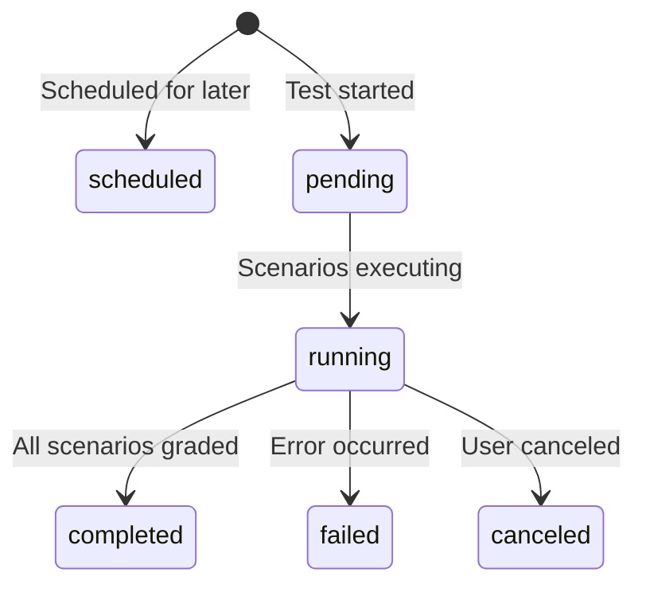

# Runs

A run represents a single execution of a test against a target AI agent. It tracks:

- Execution status and progress
- Individual scenario results
- Aggregate metrics and pass rates
- Timing information

## Run Lifecycle

!!! note
    Grading happens at the **scenario run** level (each scenario is graded individually), not the test run level. A test run moves directly from `running` to `completed` once all scenario runs finish.

### Status Definitions

| Status | Description |
|--------|-------------|
| `scheduled` | Run scheduled for future execution |
| `pending` | Run created, waiting to start |
| `running` | Scenarios actively executing and being graded |
| `completed` | All scenarios finished |
| `failed` | Unrecoverable error occurred |
| `canceled` | User canceled the run |

### Scenario Run Statuses

Individual scenario runs have their own status progression:

| Status | Description |
|--------|-------------|
| `pending` | Waiting to execute |
| `running` | Conversation in progress |
| `grading` | Conversation complete, being graded |
| `passed` | Graded and passed |
| `failed` | Graded and failed |
| `error` | Execution error |
| `canceled` | Canceled |

## Viewing Results

### Summary

After completion, the run shows aggregate metrics:

| Metric | Description |
|--------|-------------|
| **Pass Rate** | Percentage of scenarios that passed |
| **Passed** | Count of passing scenarios |
| **Failed** | Count of failing scenarios |
| **Errors** | Count of execution errors |
| **Duration** | Total run time |

### Detail View

Click any scenario to see:

- Full conversation transcript
- Per-criterion grading results
- Evidence quotes from the transcript
- Timing metrics
